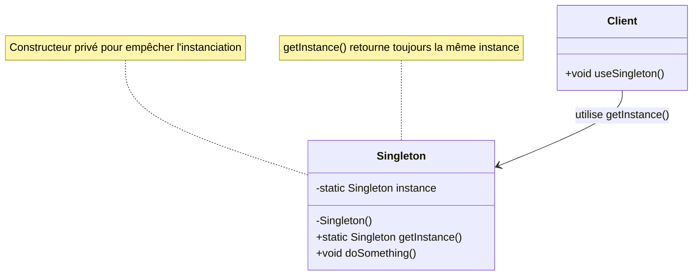

# Singleton Pattern

## Définition

Le pattern Singleton garantit qu'une classe n'a qu'une seule instance et fournit un point d'accès global à cette instance. C'est l'un des patterns de création les plus connus.

## Problème Résolu

Le pattern Singleton résout plusieurs problèmes communs :

1. **Contrôle d'instanciation** : S'assurer qu'il n'y a qu'une seule instance d'une classe
2. **Accès global** : Fournir un accès global à cette instance unique
3. **Gestion des ressources** : Centraliser la gestion de ressources partagées (configuration, connexions, logs)

### Cas d'Usage Typiques

- Configuration globale de l'application
- Gestionnaire de logs
- Connexion à une base de données
- Cache partagé
- Gestionnaire de threads (Thread Pool)
- Registre central d'objets

### Quand Ne PAS Utiliser Singleton

- Les classes qui changent d'état entre les appels
- Les classes avec beaucoup de dépendances (rend les tests difficiles)
- Les classes qui doivent être héritables ou polymorphiques
- La plupart des cas où vous pensez avoir besoin d'un Singleton (considérez l'injection de dépendances)

## Structure

### Diagramme de Classe Mermaid



### Composants du Pattern

1. **Instance statique** : Variable qui stocke l'instance unique
2. **Constructeur privé** : Empêche l'instanciation directe
3. **Méthode getInstance()** : Fournit l'accès global à l'instance

## Utilisation dans Spring Framework

Spring utilise implicitement le pattern Singleton via le cycle de vie des beans :

### Configuration Spring

```java
@Component
public class DatabaseConnection {
    private static final Logger logger = LoggerFactory.getLogger(DatabaseConnection.class);
    
    @PostConstruct
    public void init() {
        logger.info("Initialisation de la connexion à la base de données");
    }
}
```

Par défaut, tous les beans Spring sont des singletons. Une seule instance est créée et partagée dans tout l'application.

### Scopes Spring

```java
@Component
@Scope(BeanDefinition.SCOPE_SINGLETON) // Par défaut
public class UserService { }

@Component
@Scope(BeanDefinition.SCOPE_PROTOTYPE) // Nouvelle instance à chaque injection
public class UserService { }
```

## Implémentations en Java

### 1. Eager Initialization (Chargement Immédiat)

```java
public class EagerSingleton {
    private static final EagerSingleton instance = new EagerSingleton();
    
    private EagerSingleton() {
        // Constructeur privé
    }
    
    public static EagerSingleton getInstance() {
        return instance;
    }
}
```

**Avantages** : Simple, thread-safe
**Inconvénients** : Instance créée même si non utilisée (consommation mémoire)

### 2. Lazy Initialization (Chargement Différé)

```java
public class LazySingleton {
    private static LazySingleton instance;
    
    private LazySingleton() { }
    
    public static LazySingleton getInstance() {
        if (instance == null) {
            instance = new LazySingleton();
        }
        return instance;
    }
}
```

**Avantages** : Instance créée uniquement si nécessaire
**Inconvénients** : Non thread-safe dans un environnement multi-thread

### 3. Thread-Safe Lazy Initialization

```java
public class ThreadSafeSingleton {
    private static ThreadSafeSingleton instance;
    
    private ThreadSafeSingleton() { }
    
    public static synchronized ThreadSafeSingleton getInstance() {
        if (instance == null) {
            instance = new ThreadSafeSingleton();
        }
        return instance;
    }
}
```

**Avantages** : Thread-safe
**Inconvénients** : Performance réduite à cause de la synchronisation à chaque appel

### 4. Double-Checked Locking (Recommandé pour Multithreading)

```java
public class DoubleCheckedLockingSingleton {
    private static volatile DoubleCheckedLockingSingleton instance;
    
    private DoubleCheckedLockingSingleton() { }
    
    public static DoubleCheckedLockingSingleton getInstance() {
        if (instance == null) {
            synchronized (DoubleCheckedLockingSingleton.class) {
                if (instance == null) {
                    instance = new DoubleCheckedLockingSingleton();
                }
            }
        }
        return instance;
    }
}
```

**Avantages** : Thread-safe avec meilleures performances
**Inconvénients** : Code plus complexe, utilisation de volatile nécessaire

### 5. Initialization-on-Demand Holder (Recommandé Généralement)

```java
public class HolderSingleton {
    private HolderSingleton() { }
    
    private static class Holder {
        private static final HolderSingleton INSTANCE = new HolderSingleton();
    }
    
    public static HolderSingleton getInstance() {
        return Holder.INSTANCE;
    }
}
```

**Avantages** : 
- Thread-safe garanti par le JVM
- Lazy initialization
- Bonnes performances
- Code simple

**Inconvénients** : Aucun connu, considéré comme la meilleure approche

### 6. Enum Singleton (Recommandé par Joshua Bloch)

```java
public enum EnumSingleton {
    INSTANCE;
    
    public void doSomething() {
        System.out.println("Faire quelque chose");
    }
}
```

**Avantages** :
- Thread-safe garanti par la JVM
- Résistant à la sérialisation et désérialisation
- Garantit une instance unique
- Code très simple

**Inconvénients** : Pas d'héritage possible

## Avantages du Singleton

✅ **Instance unique garantie** : S'assure qu'il n'y a qu'une seule instance
✅ **Accès global** : Point d'accès centralisé
✅ **Initialisation contrôlée** : Contrôle quand et comment l'instance est créée
✅ **Économie de mémoire** : Partager une seule instance évite la duplication
✅ **Pattern bien connu** : Facilement compréhensible par d'autres développeurs

## Inconvénients du Singleton

❌ **Dépendances globales** : Détruit l'encapsulation, rend les dépendances cachées
❌ **Tests difficiles** : Difficile de tester et de mocker
❌ **Violation du principe de responsabilité unique** : Contrôle sa propre création ET sa logique métier
❌ **État global** : Peut causer des problèmes de concurrence
❌ **Pas d'héritage** : Le constructeur privé empêche l'héritage
❌ **Serialization** : Peut créer de nouvelles instances lors de la désérialisation (sauf avec Enum)

## Alternatives Modernes

Dans les applications modernes, on privilégie :

1. **Injection de dépendances** (Spring, Guice) : Le conteneur gère le cycle de vie
2. **Beans avec scope singleton** : Spring gère les singletons
3. **Configuration immutable** : Utiliser des classes finales avec des méthodes statiques
4. **Services stateless** : Pas besoin de Singleton si pas d'état

## Prérequis

- Sujet 09 : Héritage
- Sujet 19 : Collections (List, Set)
- Notions de base sur le multithreading

## Exercices

- **exercise-01** : Implémenter un Singleton basique pour un gestionnaire de logs
- **exercise-02** : Créer un Singleton thread-safe pour un cache de configuration
- **exercise-03** : Développer un Singleton avec enum pour un pool de connexions

## Ressources

- [Oracle - Singleton Pattern](https://docs.oracle.com/javase/tutorial/java/javaOO/enum.html)
- [Effective Java - Item 3: Enforce singleton property](https://www.oreilly.com/library/view/effective-java/9780134686097/)
