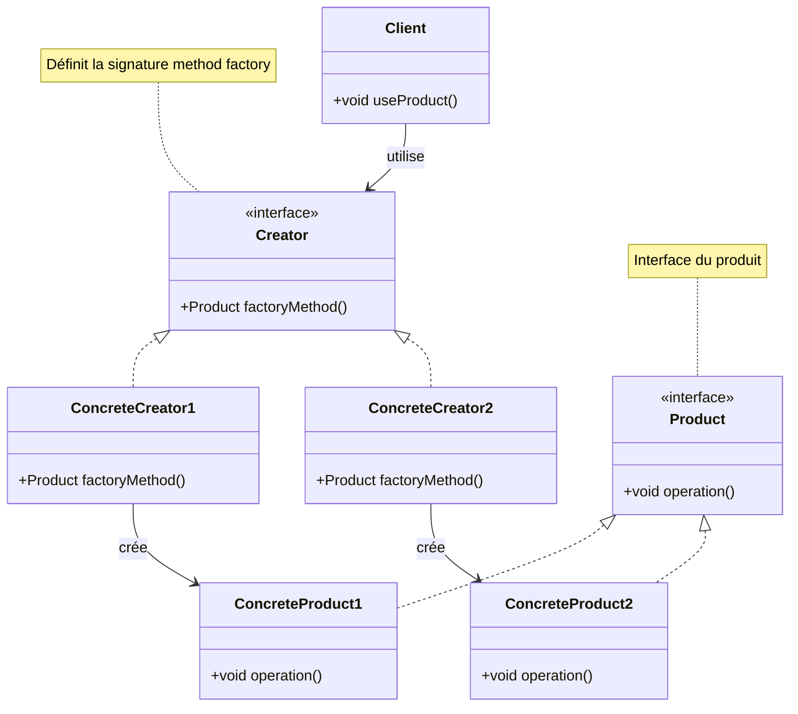

# Factory Pattern

## Définition

Le pattern Factory (usine) fournit une interface pour créer des objets sans spécifier exactement leur classe. Il encapsule la logique de création d'objets, déléguant l'instanciation à des sous-classes ou à des méthodes dédiées.

## Problème Résolu

Le pattern Factory résout plusieurs problèmes :

1. **Couplage fort** : Évite le couplage direct entre le code client et les classes concrètes
2. **Instanciation complexe** : Cache la complexité de la création d'objets
3. **Extensibilité** : Facilite l'ajout de nouveaux types sans modifier le code existant
4. **Centralisation** : Centralise la logique de création en un seul endroit

### Cas d'Usage Typiques

- Création d'objets basée sur des conditions ou des paramètres
- Systèmes où les types d'objets peuvent changer ou s'étendre
- Abstraction de la création d'objets complexes
- Frameworks qui doivent créer des objets sans connaître leurs classes exactes

## Variantes du Pattern Factory

### 1. Simple Factory (Factory Method simple)

```java
public class ShapeFactory {
    public Shape createShape(String type) {
        if ("circle".equalsIgnoreCase(type)) {
            return new Circle();
        } else if ("rectangle".equalsIgnoreCase(type)) {
            return new Rectangle();
        }
        throw new IllegalArgumentException("Type inconnu: " + type);
    }
}
```

### 2. Factory Method

Définit une méthode dans une classe de base, laissant les sous-classes décider quelles classes instancier.

### 3. Abstract Factory

Fournit une interface pour créer des familles d'objets liés sans spécifier leurs classes concrètes.

## Structure

### Diagramme de Classe Mermaid



### Composants du Pattern

1. **Product** : Interface ou classe abstraite définissant les objets à créer
2. **ConcreteProduct** : Implémentations concrètes du Product
3. **Creator** : Interface ou classe abstraite déclarant la méthode factory
4. **ConcreteCreator** : Implémentations qui créent les ConcreteProduct spécifiques
5. **Client** : Utilise le Creator pour obtenir des Product

## Utilisation dans Spring Framework

### BeanFactory et ApplicationContext

Spring utilise intensivement le pattern Factory pour créer et gérer les beans :

```java
// BeanFactory - L'interface fondamentale
public interface BeanFactory {
    Object getBean(String name);
    <T> T getBean(Class<T> requiredType);
    <T> T getBean(String name, Class<T> requiredType);
}

// ApplicationContext étend BeanFactory
ApplicationContext context = new ClassPathXmlApplicationContext("config.xml");
UserService userService = context.getBean(UserService.class);
```

### @Bean avec @Configuration

```java
@Configuration
public class AppConfig {
    @Bean
    public DataSource dataSource() {
        return new HikariDataSource(); // Factory method
    }
    
    @Bean
    public JdbcTemplate jdbcTemplate(DataSource dataSource) {
        return new JdbcTemplate(dataSource);
    }
}
```

### Factory Bean Pattern

```java
@Component
public class ServiceFactory {
    public PaymentService createPaymentService(String type) {
        return switch (type) {
            case "credit" -> new CreditCardPaymentService();
            case "paypal" -> new PayPalPaymentService();
            default -> throw new IllegalArgumentException("Type inconnu: " + type);
        };
    }
}
```

## Exemples Java

### Exemple 1 : Simple Factory

```java
// Interface du produit
interface Notification {
    void send(String message);
}

// Implémentations concrètes
class EmailNotification implements Notification {
    @Override
    public void send(String message) {
        System.out.println("Email envoyé: " + message);
    }
}

class SmsNotification implements Notification {
    @Override
    public void send(String message) {
        System.out.println("SMS envoyé: " + message);
    }
}

class PushNotification implements Notification {
    @Override
    public void send(String message) {
        System.out.println("Push envoyé: " + message);
    }
}

// Simple Factory
class NotificationFactory {
    public Notification createNotification(String channel) {
        return switch (channel.toLowerCase()) {
            case "email" -> new EmailNotification();
            case "sms" -> new SmsNotification();
            case "push" -> new PushNotification();
            default -> throw new IllegalArgumentException("Canal inconnu: " + channel);
        };
    }
}

// Utilisation
public class Client {
    public static void main(String[] args) {
        NotificationFactory factory = new NotificationFactory();
        Notification notification = factory.createNotification("email");
        notification.send("Hello World!");
    }
}
```

### Exemple 2 : Factory Method

```java
// Classe abstraite Creator
abstract class DocumentCreator {
    // Factory Method
    abstract Document createDocument();
    
    public void openDocument() {
        Document doc = createDocument();
        doc.open();
    }
}

// Creators concrets
class WordCreator extends DocumentCreator {
    @Override
    public Document createDocument() {
        return new WordDocument();
    }
}

class PdfCreator extends DocumentCreator {
    @Override
    public Document createDocument() {
        return new PdfDocument();
    }
}

interface Document {
    void open();
}

class WordDocument implements Document {
    @Override
    public void open() {
        System.out.println("Ouverture document Word");
    }
}

class PdfDocument implements Document {
    @Override
    public void open() {
        System.out.println("Ouverture document PDF");
    }
}
```

## Avantages du Factory Pattern

✅ **Découplage** : Le client ne connaît pas les classes concrètes
✅ **Extensibilité** : Facile d'ajouter de nouveaux types
✅ **Single Responsibility** : Création séparée de l'utilisation
✅ **Testabilité** : Plus facile de mocker les factories
✅ **Maintenance** : Logique de création centralisée

## Inconvénients du Factory Pattern

❌ **Complexité** : Ajoute des classes/interfaces supplémentaires
❌ **Overhead** : Peut être excessif pour des objets simples
❌ **Couplage au Creator** : Le client dépend du Creator

## Prérequis

- Sujet 09 : Héritage
- Sujet 10 : Interfaces
- Sujet 11 : Classes abstraites
- Sujet 13 : Polymorphisme

## Exercices

- **exercise-01** : Implémenter une Simple Factory pour différents types de véhicules
- **exercise-02** : Créer une Factory Method pour différents types de base de données
- **exercise-03** : Construire une Factory complexe pour un système de paiement

## Ressources

- [Spring BeanFactory](https://docs.spring.io/spring-framework/docs/current/reference/html/core.html#beans-beanfactory)
- [SourceMaking - Factory Method](https://sourcemaking.com/design_patterns/factory_method)
