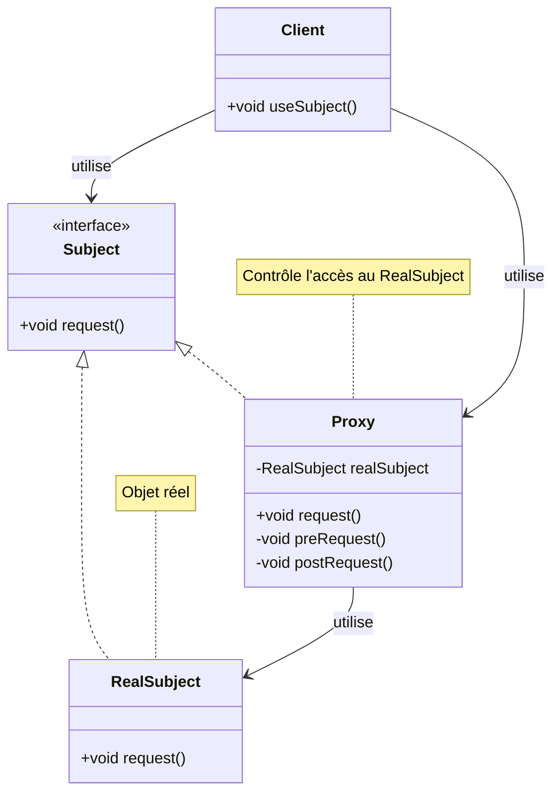

# Proxy Pattern

## Définition

Le pattern Proxy fournit un substitut ou un placeholder pour contrôler l'accès à un objet. Un proxy agit comme un intermédiaire entre le client et l'objet réel, permettant d'ajouter des fonctionnalités supplémentaires sans modifier l'objet original.

## Problème Résolu

Le pattern Proxy résout plusieurs besoins communs :

1. **Lazy Loading** : Charger un objet coûteux seulement quand nécessaire
2. **Contrôle d'accès** : Vérifier les permissions avant d'accéder à un objet
3. **Logging/Audit** : Traçabilité des accès aux objets
4. **Cache** : Mise en cache des résultats
5. **Objet distant** : Représenter un objet situé dans un autre espace d'adressage (RMI, web services)

### Cas d'Usage Typiques

- Lazy loading de données depuis une base de données
- Caching de résultats de calculs coûteux
- Gestion des permissions et authentification
- Monitoring et logging des opérations
- Références à des objets distants (RMI, CORBA)
- Protection contre les accès non autorisés

### Quand Utiliser Proxy

- Quand vous voulez ajouter des fonctionnalités sans modifier l'objet original
- Quand la création d'un objet est coûteuse
- Quand vous devez contrôler l'accès à un objet
- Quand vous travaillez avec des objets distants

## Structure

### Diagramme de Classe Mermaid



### Composants du Pattern

1. **Subject** : Interface commune pour le RealSubject et le Proxy
2. **RealSubject** : Objet réel qui effectue le travail
3. **Proxy** : Contrôle l'accès au RealSubject et peut ajouter des fonctionnalités
4. **Client** : Utilise le Subject via le Proxy

## Types de Proxies

### 1. Virtual Proxy (Lazy Loading)

Charge l'objet réel seulement quand nécessaire.

### 2. Protection Proxy

Contrôle l'accès basé sur les permissions.

### 3. Remote Proxy

Représente un objet distant (RMI, web service).

### 4. Smart Proxy

Ajoute des fonctionnalités (logging, cache, locking).

## Utilisation dans Spring Framework

### AOP (Aspect-Oriented Programming)

Spring utilise intensivement les proxies pour l'AOP :

```java
@Service
public class UserService {
    @Transactional  // Proxy s'interpose
    public void createUser(User user) {
        // Logique métier
    }
    
    @Cacheable("users")  // Cache via proxy
    public User findById(Long id) {
        return userRepository.findById(id);
    }
}
```

Spring crée un proxy JDK ou CGLIB qui intercepte les appels pour ajouter :
- Gestion de transaction
- Cache
- Logging
- Security
- Retry logic

### Lazy Initialization

```java
@Component
@Lazy  // Proxy créé, bean réel chargé seulement à la première utilisation
public class ExpensiveBean {
    public ExpensiveBean() {
        // Initialisation coûteuse
    }
}
```

### Spring Security Proxy

```java
@RestController
@Secured("ROLE_ADMIN")  // Proxy vérifie les permissions
public class AdminController {
    
    @GetMapping("/admin")
    @Secured("ROLE_ADMIN")
    public String admin() {
        return "Admin page";
    }
}
```

## Exemples Java

### Exemple 1 : Virtual Proxy (Lazy Loading)

```java
// Interface commune
interface Image {
    void display();
}

// Objet réel (coûteux à charger)
class RealImage implements Image {
    private String filename;
    
    public RealImage(String filename) {
        this.filename = filename;
        loadFromDisk();  // Chargement coûteux
    }
    
    private void loadFromDisk() {
        System.out.println("Chargement de l'image depuis le disque: " + filename);
    }
    
    @Override
    public void display() {
        System.out.println("Affichage de l'image: " + filename);
    }
}

// Proxy
class ProxyImage implements Image {
    private RealImage realImage;
    private String filename;
    
    public ProxyImage(String filename) {
        this.filename = filename;
    }
    
    @Override
    public void display() {
        if (realImage == null) {
            realImage = new RealImage(filename);  // Lazy loading
        }
        realImage.display();
    }
}

// Utilisation
public class Client {
    public static void main(String[] args) {
        Image image = new ProxyImage("photo.jpg");
        System.out.println("Image créée (pas encore chargée)");
        image.display();  // Chargement maintenant
        image.display();  // Déjà chargée
    }
}
```

### Exemple 2 : Protection Proxy

```java
interface BankAccount {
    void withdraw(double amount);
    double getBalance();
}

class RealBankAccount implements BankAccount {
    private double balance;
    
    public RealBankAccount(double balance) {
        this.balance = balance;
    }
    
    @Override
    public void withdraw(double amount) {
        balance -= amount;
        System.out.println("Retrait de " + amount + "€");
    }
    
    @Override
    public double getBalance() {
        return balance;
    }
}

class ProtectionProxy implements BankAccount {
    private RealBankAccount account;
    private String userRole;
    
    public ProtectionProxy(String userRole, double initialBalance) {
        this.userRole = userRole;
        this.account = new RealBankAccount(initialBalance);
    }
    
    @Override
    public void withdraw(double amount) {
        if ("ADMIN".equals(userRole)) {
            account.withdraw(amount);
        } else {
            System.out.println("Accès refusé: vous n'avez pas les droits");
        }
    }
    
    @Override
    public double getBalance() {
        return account.getBalance();
    }
}
```

## Avantages du Proxy Pattern

✅ **Lazy Loading** : Améliore les performances en chargeant à la demande
✅ **Protection** : Contrôle d'accès sans modifier l'objet original
✅ **Transparence** : Le client utilise le même interface
✅ **Flexibilité** : Ajoute des fonctionnalités sans héritage
✅ **Single Responsibility** : Séparation des préoccupations

## Inconvénients du Proxy Pattern

❌ **Complexité** : Ajoute une couche d'abstraction
❌ **Performance** : Léger overhead pour les appels
❌ **Moins de clarté** : Le code est un peu moins direct

## Prérequis

- Sujet 09 : Héritage
- Sujet 10 : Interfaces
- Bonne compréhension de la composition

## Exercices

- **exercise-01** : Implémenter un Virtual Proxy pour le lazy loading d'images
- **exercise-02** : Créer un Protection Proxy pour sécuriser des opérations bancaires
- **exercise-03** : Développer un Smart Proxy avec cache pour des calculs coûteux

## Ressources

- [Spring AOP](https://docs.spring.io/spring-framework/docs/current/reference/html/core.html#aop)
- [SourceMaking - Proxy Pattern](https://sourcemaking.com/design_patterns/proxy)
