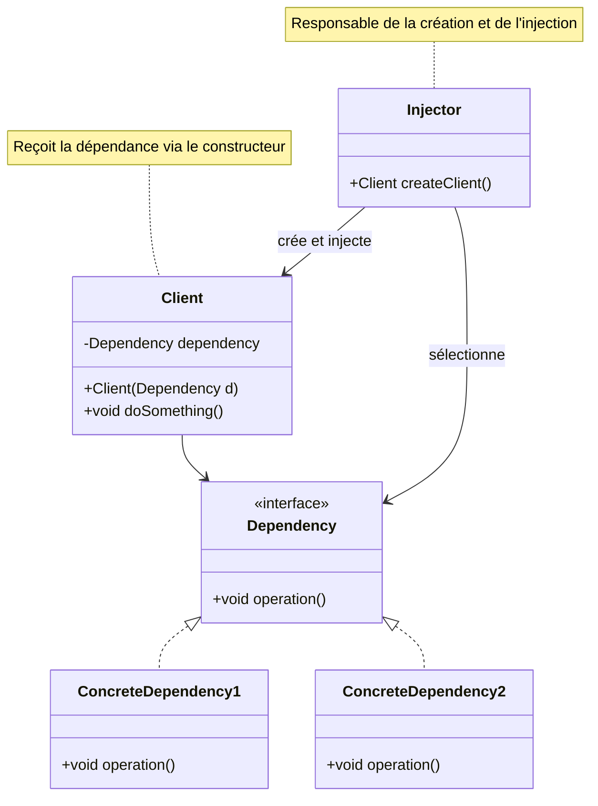

# Dependency Injection Pattern

## Définition

Le pattern Dependency Injection (Injection de Dépendances) est un principe fondamental où les dépendances d'une classe sont fournies depuis l'extérieur plutôt que créées en interne. C'est le cœur du framework Spring et un principe clé de l'Inversion of Control (IoC).

## Problème Résolu

Le pattern DI résout plusieurs problèmes critiques :

1. **Couplage fort** : Élimine les dépendances rigides entre classes
2. **Testabilité** : Permet de mocker facilement les dépendances
3. **Flexibilité** : Changement d'implémentation sans modifier le code client
4. **Responsabilités claires** : Chaque classe se concentre sur sa logique métier
5. **Configuration centralisée** : Gestion centralisée des objets

### Avant Dependency Injection

```java
// Problème: couplage fort
public class UserService {
    private UserRepository repository = new JdbcUserRepository(); // Créé en interne
    
    public User findById(Long id) {
        return repository.findById(id);
    }
}
```

**Problèmes** :
- Impossible de tester sans base de données
- Difficile de changer l'implémentation
- UserService est responsable de la création

### Après Dependency Injection

```java
// Solution: injection des dépendances
public class UserService {
    private UserRepository repository;
    
    // Injection via constructeur
    public UserService(UserRepository repository) {
        this.repository = repository;
    }
    
    public User findById(Long id) {
        return repository.findById(id);
    }
}
```

**Avantages** :
- Facile à tester (mock possible)
- Changement d'implémentation transparent
- Séparation des responsabilités

## Structure

### Diagramme de Classe Mermaid



### Types d'Injection

#### 1. Constructor Injection (Recommandé)

```java
public class UserService {
    private UserRepository repository;
    
    public UserService(UserRepository repository) {
        this.repository = repository;
    }
}
```

#### 2. Setter Injection

```java
public class UserService {
    private UserRepository repository;
    
    public void setRepository(UserRepository repository) {
        this.repository = repository;
    }
}
```

#### 3. Field Injection (Non recommandé)

```java
public class UserService {
    @Autowired
    private UserRepository repository;
}
```

## Utilisation dans Spring Framework

Spring est construit autour de la DI :

```java
@Component
public class UserService {
    private final UserRepository repository;
    
    public UserService(UserRepository repository) {
        this.repository = repository;
    }
}

@Repository
public class JpaUserRepository implements UserRepository {
    // Implementation
}

// Spring injecte automatiquement
@Configuration
public class AppConfig {
    @Bean
    public UserService userService(UserRepository repository) {
        return new UserService(repository);
    }
}
```

### Spring Annotations

```java
@Component
public class EmailService {
    // Constructor injection (recommandé)
    @Autowired
    public EmailService(EmailSender sender) {
        this.sender = sender;
    }
    
    // Field injection (non recommandé)
    @Autowired
    private NotificationService notificationService;
    
    // Setter injection
    @Autowired
    public void setLogger(Logger logger) {
        this.logger = logger;
    }
}
```

## Exemples Java

### Exemple 1 : Constructor Injection Manuel

```java
interface MessageService {
    void sendMessage(String message);
}

class EmailService implements MessageService {
    @Override
    public void sendMessage(String message) {
        System.out.println("Email: " + message);
    }
}

class SMSService implements MessageService {
    @Override
    public void sendMessage(String message) {
        System.out.println("SMS: " + message);
    }
}

class NotificationService {
    private MessageService messageService;
    
    // Constructor Injection
    public NotificationService(MessageService messageService) {
        this.messageService = messageService;
    }
    
    public void notify(String message) {
        messageService.sendMessage(message);
    }
}

// Utilisation
public class Client {
    public static void main(String[] args) {
        // Injection manuelle
        MessageService emailService = new EmailService();
        NotificationService notification = new NotificationService(emailService);
        notification.notify("Hello!");
        
        // Changer d'implémentation facilement
        MessageService smsService = new SMSService();
        NotificationService notification2 = new NotificationService(smsService);
        notification2.notify("Hello!");
    }
}
```

### Exemple 2 : IoC Container Simple

```java
class SimpleContainer {
    private Map<Class<?>, Object> beans = new HashMap<>();
    
    public void register(Class<?> type, Object instance) {
        beans.put(type, instance);
    }
    
    public <T> T getBean(Class<T> type) {
        return type.cast(beans.get(type));
    }
}

// Utilisation
SimpleContainer container = new SimpleContainer();
container.register(UserRepository.class, new JpaUserRepository());
container.register(UserService.class, new UserService(container.getBean(UserRepository.class)));
```

## Avantages du Dependency Injection

✅ **Testabilité** : Mock facile des dépendances
✅ **Flexibilité** : Changement d'implémentation transparent
✅ **Découplage** : Réduction du couplage entre classes
✅ **Maintenabilité** : Code plus propre et organisé
✅ **Réutilisation** : Composants plus réutilisables

## Inconvénients du Dependency Injection

❌ **Complexité initiale** : Setup plus complexe
❌ **Configuration** : Nécessite une configuration
❌ **Learning curve** : Courbe d'apprentissage
❌ **Over-engineering** : Peut être excessif pour petits projets

## Prérequis

- Sujet 09 : Héritage
- Sujet 10 : Interfaces
- Notions de base sur les frameworks

## Exercices

- **exercise-01** : Implémenter la Constructor Injection manuelle
- **exercise-02** : Créer un conteneur IoC simple
- **exercise-03** : Simuler l'injection Spring avec annotations

## Ressources

- [Spring IoC Container](https://docs.spring.io/spring-framework/docs/current/reference/html/core.html#beans-introduction)
- [Martin Fowler - Inversion of Control](https://martinfowler.com/articles/injection.html)
