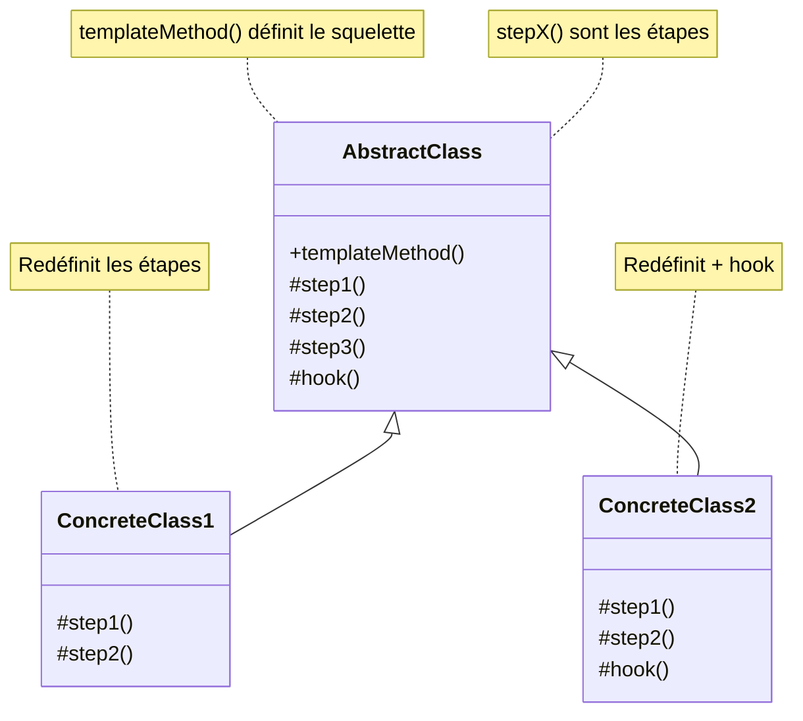

# Template Method Pattern

## Définition

Le pattern Template Method définit le squelette d'un algorithme dans une classe de base et laisse les sous-classes redéfinir certaines étapes sans modifier la structure globale de l'algorithme.

## Problème Résolu

Le pattern Template Method résout le besoin de :

1. **Réutiliser du code** : Éviter la duplication d'algorithmes similaires
2. **Contrôler l'algorithme** : Maintenir la structure globale fixe
3. **Extensibilité** : Permettre des variations d'implémentation
4. **DRY Principle** : Don't Repeat Yourself

### Cas d'Usage Typiques

- Algorithme avec des étapes communes et des variantes
- Génération de rapports (structure fixe, contenus variés)
- Traitement de données (structure fixe, logiques spécifiques)
- Classes abstraites avec méthodes template
- Hooks pour personnaliser le comportement

## Structure

### Diagramme de Classe Mermaid



### Composants du Pattern

1. **AbstractClass** : Classe de base avec templateMethod()
2. **ConcreteClass** : Sous-classes redéfinissant les steps
3. **templateMethod()** : Définit la structure de l'algorithme
4. **Primitive Methods** : Méthodes à redéfinir
5. **Hook Methods** : Méthodes optionnelles

## Utilisation dans Spring Framework

Spring utilise largement ce pattern :

```java
// JdbcTemplate
public <T> T execute(ConnectionCallback<T> action) {
    Connection con = getConnection();  // Step 1
    try {
        return action.doInConnection(con);  // Step 2 (customizable)
    } finally {
        releaseConnection(con);  // Step 3
    }
}
```

```java
// RestTemplate
public <T> ResponseEntity<T> exchange(
    String url, HttpMethod method, 
    HttpEntity<?> requestEntity, 
    Class<T> responseType
) throws RestClientException {
    // Structure commune pour tous les appels HTTP
    // Variation dans les paramètres
}
```

```java
// TransactionTemplate
public <T> T execute(TransactionCallback<T> action) {
    TransactionStatus status = transactionManager.getTransaction(definition);
    try {
        T result = action.doInTransaction(status);  // Custom logic
        transactionManager.commit(status);
        return result;
    } catch (Exception e) {
        transactionManager.rollback(status);
        throw e;
    }
}
```

## Exemples Java

### Exemple 1 : Traitement de Données

```java
abstract class DataProcessor {
    // Template Method
    public final void processData(String input) {
        String cleaned = cleanData(input);  // Step 1
        String transformed = transformData(cleaned);  // Step 2
        validateData(transformed);  // Step 3
        saveData(transformed);  // Step 4
    }
    
    // Primitives à redéfinir
    protected abstract String cleanData(String data);
    protected abstract String transformData(String data);
    
    // Hook optionnel
    protected void validateData(String data) {
        // Défaut: validation basique
    }
    
    // Comportement commun
    private void saveData(String data) {
        System.out.println("Sauvegarde: " + data);
    }
}

class CSVProcessor extends DataProcessor {
    @Override
    protected String cleanData(String data) {
        return data.replaceAll(",\\s+", ",");
    }
    
    @Override
    protected String transformData(String data) {
        return data.toUpperCase();
    }
}

class XMLProcessor extends DataProcessor {
    @Override
    protected String cleanData(String data) {
        return data.trim().replaceAll("\\s+", " ");
    }
    
    @Override
    protected String transformData(String data) {
        return data.toLowerCase();
    }
    
    @Override
    protected void validateData(String data) {
        if (!data.startsWith("<")) {
            throw new IllegalArgumentException("XML invalide");
        }
    }
}
```

### Exemple 2 : Génération de Rapports

```java
abstract class ReportGenerator {
    // Template Method
    public final String generate() {
        String header = createHeader();
        String body = createBody();
        String footer = createFooter();
        return combine(header, body, footer);
    }
    
    // Steps à redéfinir
    protected abstract String createHeader();
    protected abstract String createBody();
    protected abstract String createFooter();
    
    // Hook
    protected String combine(String header, String body, String footer) {
        return header + " " + body + " " + footer;
    }
}
```

## Avantages du Template Method

✅ **Réutilisation** : Code commun dans la classe de base
✅ **Contrôle** : Structure de l'algorithme contrôlée
✅ **Extensibilité** : Facile d'ajouter de nouvelles variantes
✅ **DRY** : Évite la duplication
✅ **Maintenance** : Changements centralisés

## Inconvénients du Template Method

❌ **Héritage rigid** : Héritage peut limiter la flexibilité
❌ **Overhead** : Classe abstraite supplémentaire
❌ **Limitations** : Toutes les variantes doivent suivre la structure

## Prérequis

- Sujet 09 : Héritage
- Sujet 11 : Classes abstraites
- Bonne compréhension de la POO

## Exercices

- **exercise-01** : Implémenter un template pour traiter des fichiers
- **exercise-02** : Créer un template pour générer des rapports
- **exercise-03** : Développer un système de jeu avec template method

## Ressources

- [Spring JdbcTemplate](https://docs.spring.io/spring-framework/docs/current/reference/html/data-access.html#jdbc-JdbcTemplate)
- [SourceMaking - Template Method](https://sourcemaking.com/design_patterns/template_method)
