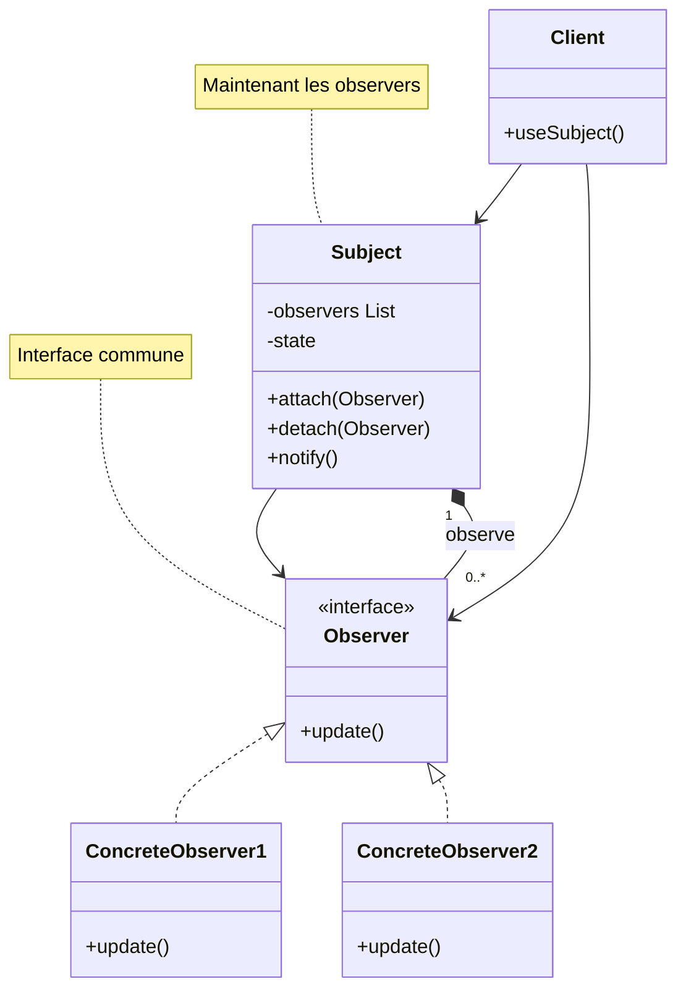

# Observer Pattern

## Définition

Le pattern Observer définit une dépendance un-à-plusieurs entre objets de sorte qu'à chaque changement d'état d'un objet, tous ses dépendants sont automatiquement notifiés et mis à jour.

## Problème Résolu

Le pattern Observer résout le besoin de :

1. **Découplage** : Objets observables indépendants des observateurs
2. **Notification automatique** : Mise à jour automatique des abonnés
3. **Scalabilité** : Facile d'ajouter/retirer des observateurs
4. **Réactivité** : Système réactif aux changements

### Cas d'Usage Typiques

- Système de notifications push
- Modèle MVC (View observe Model)
- Événements utilisateur (clics, touches)
- Pub/Sub messaging
- Monitoring et alerting
- Réactive programming

## Structure

### Diagramme de Classe Mermaid



### Composants du Pattern

1. **Subject (Observable)** : Objet observable, maintient la liste des observateurs
2. **Observer** : Interface pour les observateurs
3. **ConcreteObserver** : Implémentations concrètes
4. **attach/detach** : Abonner/Désabonner
5. **notify** : Notifier tous les observateurs

## Utilisation dans Spring Framework

Spring utilise largement ce pattern :

```java
// Spring Events
@EventListener
public void handleOrderEvent(OrderCreatedEvent event) {
    System.out.println("Order created: " + event.getOrderId());
}

@Component
public class OrderService {
    @Autowired
    private ApplicationEventPublisher eventPublisher;
    
    public void createOrder(Order order) {
        // Créer la commande
        eventPublisher.publishEvent(new OrderCreatedEvent(order));
    }
}

// Classe d'événement
public class OrderCreatedEvent extends ApplicationEvent {
    private Order order;
    
    public OrderCreatedEvent(Order order) {
        super(order);
        this.order = order;
    }
}
```

### Spring Application Events

```java
// Publisher
@Autowired
private ApplicationEventPublisher publisher;

publisher.publishEvent(new UserRegisteredEvent(user));

// Listener
@EventListener
public void handleUserRegistration(UserRegisteredEvent event) {
    sendWelcomeEmail(event.getUser());
}

@EventListener
public void logUserRegistration(UserRegisteredEvent event) {
    logger.info("User registered: " + event.getUser());
}
```

## Exemples Java

### Exemple 1 : Système de Notifications

```java
interface Observer {
    void update(String message);
}

interface Subject {
    void attach(Observer observer);
    void detach(Observer observer);
    void notifyObservers(String message);
}

class NewsAgency implements Subject {
    private List<Observer> observers = new ArrayList<>();
    
    @Override
    public void attach(Observer observer) {
        observers.add(observer);
    }
    
    @Override
    public void detach(Observer observer) {
        observers.remove(observer);
    }
    
    @Override
    public void notifyObservers(String message) {
        observers.forEach(observer -> observer.update(message));
    }
    
    public void news(String message) {
        notifyObservers(message);
    }
}

class NewsChannel implements Observer {
    private String name;
    
    public NewsChannel(String name) {
        this.name = name;
    }
    
    @Override
    public void update(String message) {
        System.out.println(name + " received: " + message);
    }
}

// Utilisation
public class Client {
    public static void main(String[] args) {
        NewsAgency agency = new NewsAgency();
        NewsChannel channel1 = new NewsChannel("CNN");
        NewsChannel channel2 = new NewsChannel("BBC");
        
        agency.attach(channel1);
        agency.attach(channel2);
        
        agency.news("Breaking: Important news!");
    }
}
```

### Exemple 2 : Système de Stocks

```java
interface StockObserver {
    void update(String stockSymbol, double price);
}

class StockMarket implements Subject {
    private List<Observer> observers = new ArrayList<>();
    private Map<String, Double> stocks = new HashMap<>();
    
    public void setPrice(String symbol, double price) {
        stocks.put(symbol, price);
        notifyObservers(symbol + " : " + price);
    }
    
    @Override
    public void attach(Observer observer) {
        observers.add(observer);
    }
    
    @Override
    public void detach(Observer observer) {
        observers.remove(observer);
    }
    
    @Override
    public void notifyObservers(String message) {
        observers.forEach(observer -> observer.update(message));
    }
}

class Trader implements StockObserver {
    private String name;
    
    public Trader(String name) {
        this.name = name;
    }
    
    @Override
    public void update(String stockSymbol, double price) {
        System.out.println(name + " notified: " + stockSymbol + " = " + price);
    }
}
```

## Java Built-in Observer

Java fournit `Observable` et `Observer` (deprecated depuis Java 9) :

```java
import java.util.Observable;
import java.util.Observer;

class MyModel extends Observable {
    public void change() {
        setChanged();
        notifyObservers("Something changed");
    }
}

class MyView implements Observer {
    @Override
    public void update(Observable o, Object arg) {
        System.out.println("Update: " + arg);
    }
}
```

⚠️ Ces classes sont deprecated car :
- Non thread-safe
- Violent la composition over inheritance
- Enumérations impossibles

## Avantages du Observer Pattern

✅ **Découplage** : Sujet et observateurs découplés
✅ **Extensibilité** : Facile d'ajouter de nouveaux observateurs
✅ **Réactivité** : Notification automatique
✅ **Principe Open/Closed** : Ouvert à l'extension, fermé à la modification
✅ **Flexibilité** : Plusieurs observateurs peuvent réagir différemment

## Inconvénients du Observer Pattern

❌ **Ordre** : Ordre de notification non garanti
❌ **Performance** : Notifications peuvent être coûteuses
❌ **Memory leaks** : Oublier de détacher les observateurs
❌ **Chaos** : Peut créer des bugs difficiles à tracer

## Prérequis

- Sujet 10 : Interfaces
- Notions de List/ArrayList
- Concepts de base sur les événements

## Exercices

- **exercise-01** : Implémenter un système de news simple
- **exercise-02** : Créer un système de température avec alertes
- **exercise-03** : Développer un système d'événements Spring-like

## Ressources

- [Spring Events](https://docs.spring.io/spring-framework/docs/current/reference/html/core.html#context-functionality-events)
- [SourceMaking - Observer Pattern](https://sourcemaking.com/design_patterns/observer)
