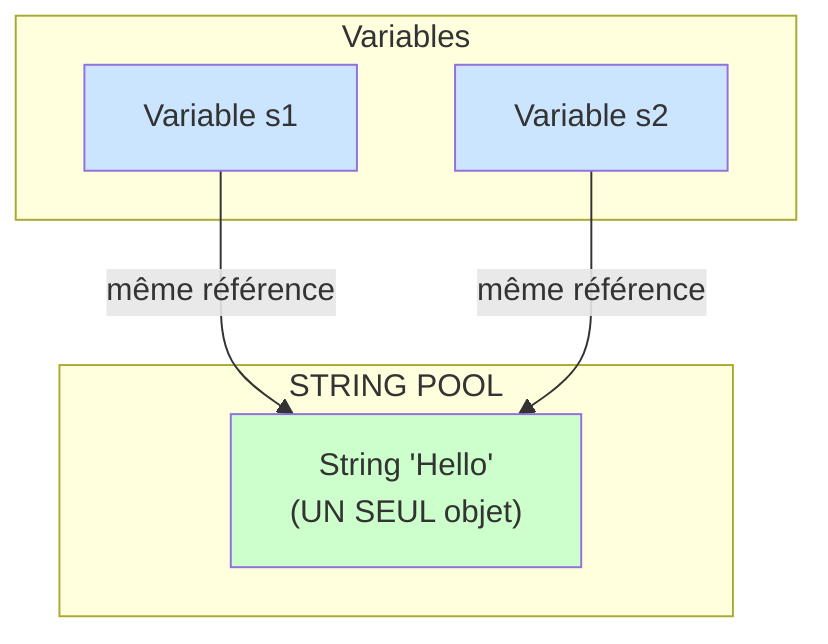
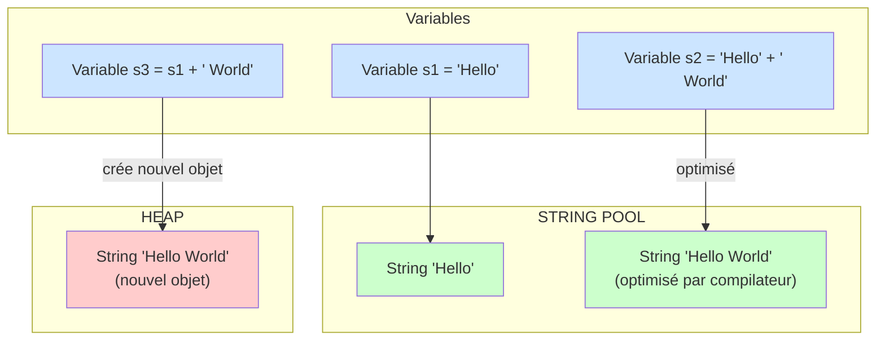
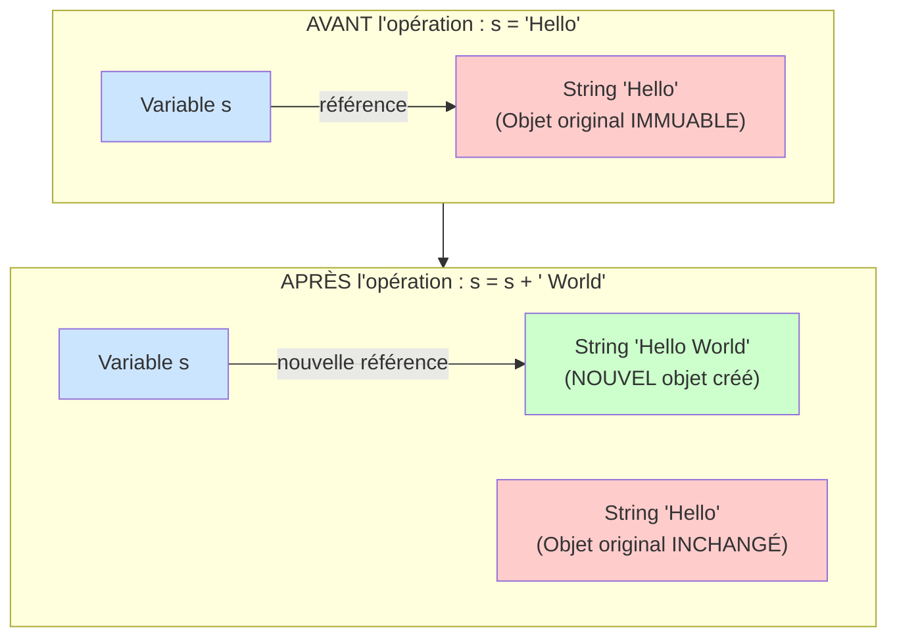
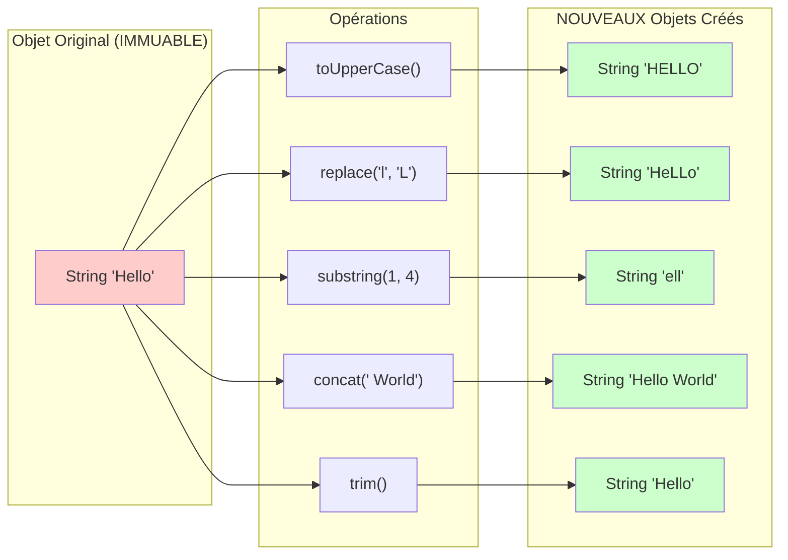
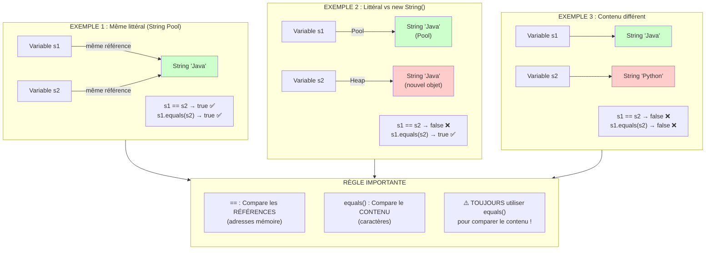

# 30 - Les Chaînes de Caractères (Strings)

## Vue d'Ensemble

Les chaînes de caractères (String) sont l'un des types les plus utilisés en Java. Une String représente une séquence de caractères et est immuable (immutable), ce qui signifie qu'une fois créée, elle ne peut pas être modifiée.

## Concepts Clés

1. **Création de String** : Littéraux vs constructeur
2. **Immutabilité** : Les String ne peuvent pas être modifiées après création
3. **Méthodes courantes** : length(), charAt(), substring(), indexOf(), etc.
4. **Comparaison** : equals() vs ==
5. **Manipulation** : concat(), replace(), toUpperCase(), toLowerCase(), trim()
6. **StringBuilder/StringBuffer** : Pour des modifications efficaces

## Explications Détaillées

### Création de String

Il existe plusieurs façons de créer une String en Java :

```java
// Méthode 1 : Littéral (recommandé)
String s1 = "Hello";

// Méthode 2 : Constructeur
String s2 = new String("Hello");

// Méthode 3 : À partir d'un tableau de caractères
char[] chars = {'H', 'e', 'l', 'l', 'o'};
String s3 = new String(chars);
```

**Important** : Les littéraux String sont stockés dans le "String Pool", ce qui permet la réutilisation. Utilisez `new String()` uniquement si nécessaire.

#### Schéma 4 : Le String Pool (Pool de Chaînes)

Le String Pool est une zone mémoire spéciale où Java stocke les littéraux String pour optimiser la mémoire.

**CAS 1 : Littéraux (String Pool)**



**Résultat** : `s1 == s2` → `true` (même référence), `s1.equals(s2)` → `true` (même contenu)

**CAS 2 : Constructeur new String()**

```mermaid
flowchart TD
    subgraph Pool2["STRING POOL"]
        obj2["String 'Hello'<br/>(dans le Pool)"]
    end
    
    subgraph Heap["HEAP (mémoire normale)"]
        obj3["String 'Hello'<br/>(NOUVEL objet)"]
    end
    
    subgraph Variables2["Variables"]
        s3[Variable s1 = 'Hello']
        s4[Variable s2 = new String('Hello')]
    end
    
    s3 -->|récupère du Pool| obj2
    s4 -->|crée nouvel objet| obj3
    
    style obj2 fill:#ccffcc
    style obj3 fill:#ffcccc
    style s3 fill:#cce5ff
    style s4 fill:#cce5ff
```

**Résultat** : `s1 == s2` → `false` (références différentes), `s1.equals(s2)` → `true` (même contenu)

**CAS 3 : Concaténation de Littéraux**



**Note** : `s2` et `s3` peuvent avoir des références différentes selon l'optimisation du compilateur.

### Immutabilité

Les String sont immuables. Toute opération qui semble modifier une String crée en réalité une nouvelle String :

```java
String s = "Hello";
s = s + " World";  // Crée une nouvelle String, ne modifie pas l'originale
```

#### Schéma 1 : Concept d'Immutabilité



**Important** : L'objet original "Hello" n'est PAS modifié ! Une NOUVELLE String "Hello World" est créée.

#### Schéma 2 : Opérations qui Créent de Nouveaux Objets



**Règle** : Toute opération qui semble modifier une String crée en réalité un NOUVEL objet String. L'objet original reste inchangé.

#### Schéma 3 : Comparaison String vs StringBuilder (Immuable vs Mutable)

```mermaid
flowchart TB
    subgraph StringImmutable["STRING (IMMUABLE)"]
        direction LR
        s1[Variable s] -->|étape 1| obj1["String 'Hello'"]
        s1 -->|étape 2: s = s + ' World'| obj2["String 'Hello World'<br/>(NOUVEL objet)"]
        obj1_old["String 'Hello'<br/>(ancien objet)"]
        
        style obj1 fill:#ffcccc
        style obj1_old fill:#ffcccc
        style obj2 fill:#ccffcc
    end
    
    subgraph StringBuilderMutable["STRINGBUILDER (MUTABLE)"]
        direction LR
        sb1[Variable sb] -->|étape 1| sb_obj1["StringBuilder 'Hello'"]
        sb1 -->|étape 2: sb.append(' World')| sb_obj2["StringBuilder 'Hello World'<br/>(MÊME objet modifié)"]
        
        sb_obj1 -.->|modification| sb_obj2
        
        style sb_obj1 fill:#ffffcc
        style sb_obj2 fill:#ffffcc
    end
    
    subgraph Comparaison["COMPARAISON"]
        direction TB
        result1["String:<br/>2 objets en mémoire<br/>(plus de mémoire)"]
        result2["StringBuilder:<br/>1 objet modifié<br/>(moins de mémoire, plus rapide)"]
    end
    
    StringImmutable --> Comparaison
    StringBuilderMutable --> Comparaison
```

### Méthodes Courantes

| Méthode | Description | Exemple |
|---------|-------------|---------|
| `length()` | Retourne la longueur | `"Hello".length()` → 5 |
| `charAt(int)` | Retourne le caractère à l'index | `"Hello".charAt(0)` → 'H' |
| `substring(int, int)` | Extrait une sous-chaîne | `"Hello".substring(1, 3)` → "el" |
| `indexOf(String)` | Trouve l'index d'une sous-chaîne | `"Hello".indexOf("l")` → 2 |
| `equals(String)` | Compare le contenu | `"Hello".equals("Hello")` → true |
| `equalsIgnoreCase(String)` | Compare sans tenir compte de la casse | `"Hello".equalsIgnoreCase("hello")` → true |
| `toUpperCase()` | Convertit en majuscules | `"Hello".toUpperCase()` → "HELLO" |
| `toLowerCase()` | Convertit en minuscules | `"Hello".toLowerCase()` → "hello" |
| `trim()` | Supprime les espaces en début/fin | `" Hello ".trim()` → "Hello" |
| `replace(char, char)` | Remplace un caractère | `"Hello".replace('l', 'L')` → "HeLLo" |
| `replace(String, String)` | Remplace une sous-chaîne | `"Hello".replace("ll", "LL")` → "HeLLo" |
| `startsWith(String)` | Vérifie si commence par | `"Hello".startsWith("He")` → true |
| `endsWith(String)` | Vérifie si se termine par | `"Hello".endsWith("lo")` → true |
| `contains(String)` | Vérifie si contient | `"Hello".contains("ell")` → true |

### Comparaison de String

**Attention** : Ne jamais utiliser `==` pour comparer le contenu de deux String !

```java
String s1 = "Hello";
String s2 = "Hello";
String s3 = new String("Hello");

System.out.println(s1 == s2);        // true (même référence dans le pool)
System.out.println(s1 == s3);        // false (références différentes)
System.out.println(s1.equals(s3));   // true (même contenu)
```

**Règle d'or** : Toujours utiliser `equals()` pour comparer le contenu.

#### Schéma 5 : Comparaison == vs equals()



### Concaténation

Plusieurs façons de concaténer des String :

```java
// Méthode 1 : Opérateur +
String s1 = "Hello" + " " + "World";

// Méthode 2 : Méthode concat()
String s2 = "Hello".concat(" World");

// Méthode 3 : StringBuilder (efficace pour plusieurs concaténations)
StringBuilder sb = new StringBuilder();
sb.append("Hello");
sb.append(" ");
sb.append("World");
String s3 = sb.toString();
```

### StringBuilder et StringBuffer

Pour des modifications fréquentes de chaînes, utilisez `StringBuilder` (ou `StringBuffer` pour le multi-threading) :

```java
StringBuilder sb = new StringBuilder("Hello");
sb.append(" World");
sb.insert(5, ",");
sb.replace(0, 5, "Hi");
String result = sb.toString();  // "Hi, World"
```

**Différence** :
- `StringBuilder` : Plus rapide, non thread-safe
- `StringBuffer` : Thread-safe, légèrement plus lent

## Exemples

### Exemple 1 : Création et Affichage

```java
public class CreationString {
    public static void main(String[] args) {
        String s1 = "Hello";
        String s2 = new String("World");
        
        System.out.println(s1);  // Hello
        System.out.println(s2);  // World
    }
}
```

### Exemple 2 : Méthodes de Base

```java
public class MethodesString {
    public static void main(String[] args) {
        String s = "Hello World";
        
        System.out.println("Longueur : " + s.length());              // 11
        System.out.println("Premier caractère : " + s.charAt(0));     // H
        System.out.println("Sous-chaîne : " + s.substring(0, 5));     // Hello
        System.out.println("Index de 'o' : " + s.indexOf('o'));      // 4
        System.out.println("En majuscules : " + s.toUpperCase());     // HELLO WORLD
        System.out.println("En minuscules : " + s.toLowerCase());     // hello world
    }
}
```

### Exemple 3 : Comparaison

```java
public class ComparaisonString {
    public static void main(String[] args) {
        String s1 = "Java";
        String s2 = "Java";
        String s3 = new String("Java");
        String s4 = "java";
        
        // Comparaison avec == (référence)
        System.out.println("s1 == s2 : " + (s1 == s2));              // true
        System.out.println("s1 == s3 : " + (s1 == s3));              // false
        
        // Comparaison avec equals() (contenu)
        System.out.println("s1.equals(s3) : " + s1.equals(s3));      // true
        System.out.println("s1.equals(s4) : " + s1.equals(s4));      // false
        System.out.println("s1.equalsIgnoreCase(s4) : " + s1.equalsIgnoreCase(s4)); // true
    }
}
```

### Exemple 4 : Manipulation

```java
public class ManipulationString {
    public static void main(String[] args) {
        String s = "  Hello World  ";
        
        System.out.println("Original : '" + s + "'");
        System.out.println("Trim : '" + s.trim() + "'");              // "Hello World"
        System.out.println("Replace : " + s.replace("World", "Java")); // "  Hello Java  "
        System.out.println("StartsWith 'He' : " + s.trim().startsWith("He")); // true
        System.out.println("EndsWith 'ld' : " + s.trim().endsWith("ld"));     // true
        System.out.println("Contains 'llo' : " + s.contains("llo"));          // true
    }
}
```

### Exemple 5 : Concaténation

```java
public class Concatenation {
    public static void main(String[] args) {
        String prenom = "Jean";
        String nom = "Dupont";
        
        // Concaténation avec +
        String nomComplet1 = prenom + " " + nom;
        System.out.println(nomComplet1);  // "Jean Dupont"
        
        // Concaténation avec concat()
        String nomComplet2 = prenom.concat(" ").concat(nom);
        System.out.println(nomComplet2);  // "Jean Dupont"
        
        // Concaténation avec StringBuilder (efficace)
        StringBuilder sb = new StringBuilder();
        sb.append(prenom);
        sb.append(" ");
        sb.append(nom);
        String nomComplet3 = sb.toString();
        System.out.println(nomComplet3);  // "Jean Dupont"
    }
}
```

### Exemple 6 : StringBuilder

```java
public class StringBuilderExemple {
    public static void main(String[] args) {
        StringBuilder sb = new StringBuilder("Hello");
        
        sb.append(" World");           // "Hello World"
        sb.insert(5, ",");             // "Hello, World"
        sb.replace(0, 5, "Hi");        // "Hi, World"
        sb.delete(2, 4);               // "Hi World"
        sb.reverse();                  // "dlroW iH"
        
        System.out.println(sb.toString());
        System.out.println("Longueur : " + sb.length());
        System.out.println("Capacité : " + sb.capacity());
    }
}
```

### Exemple 7 : Immutabilité

```java
public class Immutabilite {
    public static void main(String[] args) {
        String s = "Hello";
        String original = s;
        
        // Ces opérations créent de nouvelles String
        s = s.toUpperCase();
        s = s.replace('E', 'A');
        
        System.out.println("Original : " + original);  // "Hello" (inchangé)
        System.out.println("Modifié : " + s);          // "HALLO"
        
        // Preuve que ce sont des objets différents
        System.out.println("Même référence ? " + (original == s));  // false
    }
}
```

## Points Importants

1. **Toujours utiliser `equals()` pour comparer le contenu**, jamais `==`
2. **Les String sont immuables** : chaque modification crée un nouvel objet
3. **Utilisez `StringBuilder` pour de nombreuses concaténations** pour de meilleures performances
4. **Les indices commencent à 0** : le premier caractère est à l'index 0
5. **Attention aux `NullPointerException`** : vérifiez qu'une String n'est pas null avant d'appeler ses méthodes

## Prérequis

- Sujet 02 : Variables et types de données
- Sujet 03 : Opérateurs

## Exercices

- **exercise-01** : Créer et manipuler des String de base
- **exercise-02** : Utiliser les méthodes de String (length, charAt, substring)
- **exercise-03** : Comparer des String avec equals()
- **exercise-04** : Manipuler des String (replace, toUpperCase, trim)
- **exercise-05** : Utiliser StringBuilder pour construire des chaînes

## Ressources

- [String - Oracle Documentation](https://docs.oracle.com/javase/8/docs/api/java/lang/String.html)
- [StringBuilder - Oracle Documentation](https://docs.oracle.com/javase/8/docs/api/java/lang/StringBuilder.html)

